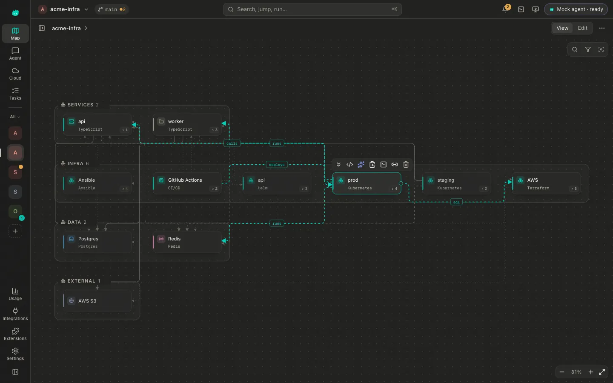
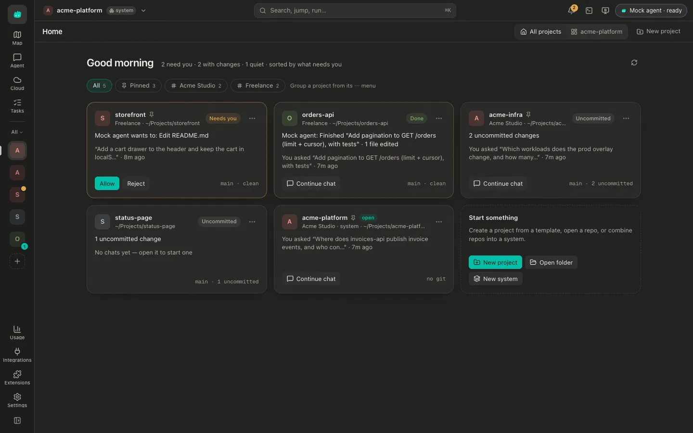
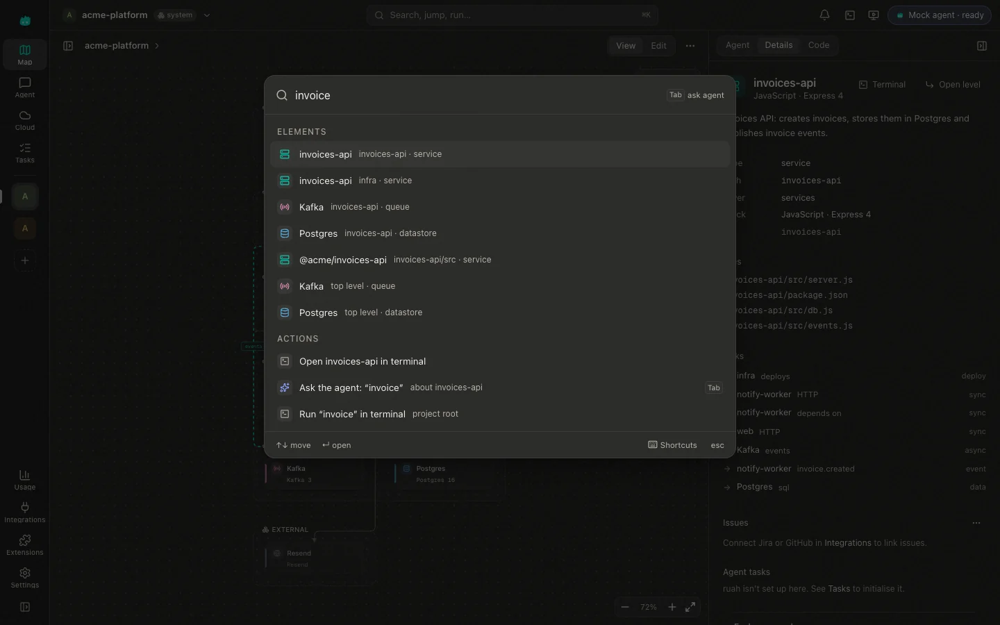
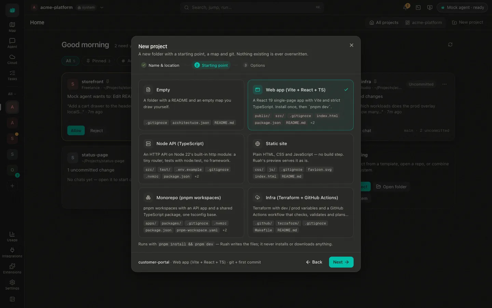
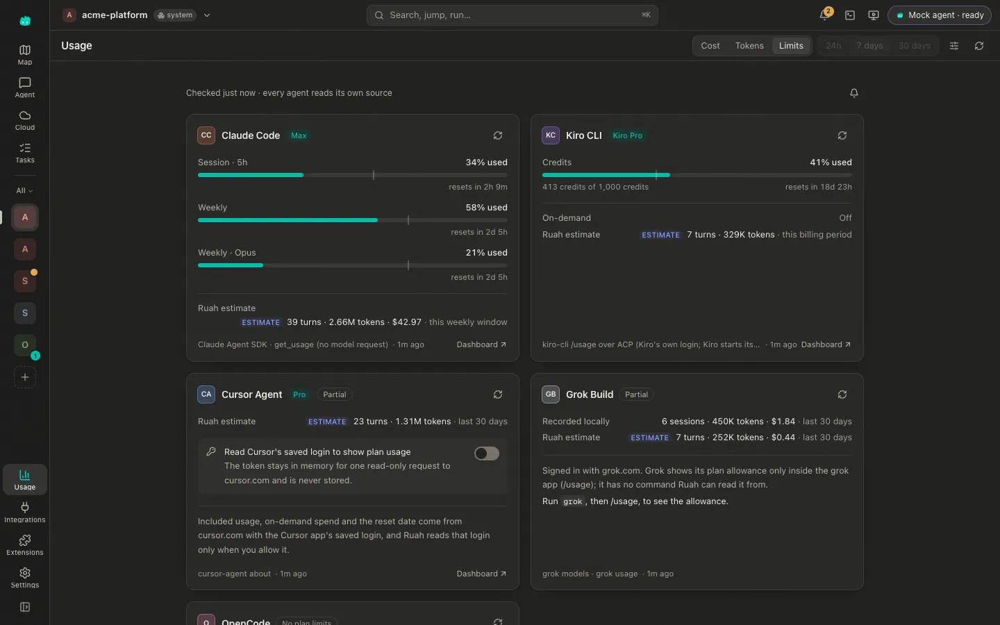
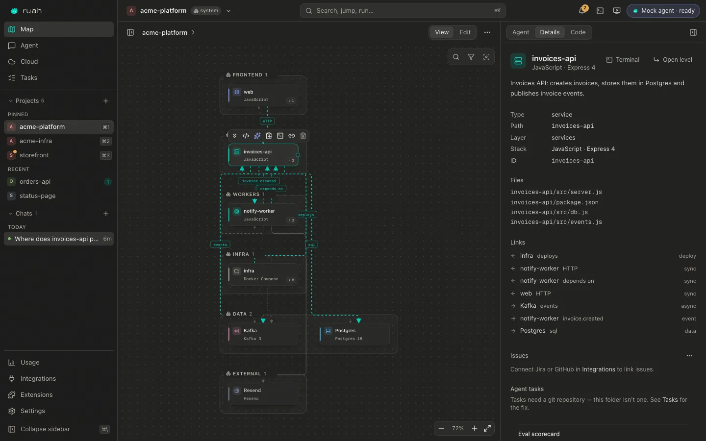

# Ruah

[](https://github.com/ruah-dev/ruah-app/actions/workflows/ci.yml)

**Ruah maps any codebase into a living architecture and lets coding agents
work on it.** Open a repo (or several), and Ruah draws what is in it: services
down to folders, files and symbols, the infrastructure that runs and ships
them, and the cloud resources behind them, healthy or not, right now. Click an
element and ask about it: Claude Code, Cursor Agent, Grok, Kiro or OpenCode get
that element as context, edit your code, and update the map while you watch.

It is a local-first macOS app. The daemon runs next to your code with your
own agent and cloud logins; there is no Ruah server, account or telemetry.



## Features

- **The map.** `ruah app scan` turns a repo into `architecture.json`: layers,
  services, modules, datastores and the edges between them. Drill in down to
  files and symbols; hand edits survive re-scans. Multi-repo systems
  (`ruah.system.json`) become one map with evidence-backed cross-repo edges.
- **Infrastructure as code on the map.** Terraform, Kubernetes, Kustomize,
  Helm, Ansible, Dockerfiles, docker compose and CI pipelines show how it all
  runs and ships.
- **Coding agents, switchable.** Claude Code (through the Claude Agent SDK) and,
  over the Agent Client Protocol, Cursor Agent, Grok Build, Kiro CLI and
  OpenCode. Switch agent or model instantly (warm agents, no restart), attach
  images, approve edits and commands from permission cards. Agents edit the map
  itself through the `ruah_*` MCP tools.
- **Home: every project at a glance.** One card per project, sorted by what
  needs you: a permission to answer (right from the card), a failed turn, cloud
  trouble, a crashed preview, a turn that finished while you were away,
  uncommitted or unpushed work. Filter by pinned projects or by group.
- **New projects in a minute.** `⇧⌘N` (or `ruah app new`) creates a project
  from an offline template (empty, Vite + React, Node API, static site, pnpm
  monorepo, Terraform + GitHub Actions) with its map, `git init` and a first
  commit; on request also a GitHub repository (`gh repo create`, private by
  default), a place in a multi-repo system and a first prompt for the agent.
  Nothing existing is ever overwritten.
- **Several projects at once.** Agents keep working when you switch projects;
  an activity feed, unread badges and notifications tell you when one finishes
  or needs you. Pinned projects keep the order you give them (`⌘1`–`⌘9`), and
  groups (tags) keep clients apart from the day job. `⌘K` jumps to any
  project, chat, element, cloud resource or action; `ruah app resume` shows
  where you left off.
- **Cloud, live.** DigitalOcean, AWS, Google Cloud, Azure, Cloudflare, Vercel,
  Supabase, Kubernetes, Railway, Fly.io, Netlify and Hetzner, read-only through
  their own CLIs: what runs where, which of it belongs to this project and why,
  and whether it is healthy.
- **Terminal and live preview.** A real terminal on every page; Ruah finds how
  to run the project's dev server, shows the page next to the agent with hot
  reload, and offers "Ask agent to fix" when it crashes. The command you pick
  is remembered on your Mac; it goes into the repo only if you save it there.
- **Extensions.** Skills, MCP servers, Kiro powers, plugins and rules: add once,
  turn on per agent after seeing what they run; secrets stay in the Keychain.
- **Issues and tasks.** Jira and GitHub issues on elements; ruah orchestration
  tasks and workflows (in a git repository).
- **Usage and limits.** Tokens and estimated cost per agent over time, and each
  agent's plan limits (Claude, Cursor, Kiro, Grok, OpenCode) before you hit them.
  Cursor's plan usage needs the Cursor app's saved login, which Ruah reads only
  after you allow it.
- **Export.** draw.io with a page per level, workflows and every technical spec.
- **Looks.** The Ruah design system: Teal + Indigo by default, Indigo, Sunrise
  and Classic teal palettes, dark, light and high-contrast themes, the Phantom
  mascots. The Standard layout is a labelled icon rail with project tiles and a
  one-row command bar; the Advanced layout is a sidebar with your projects and
  the open project's chats (`⌘\` switches).

| | |
| --- | --- |
|  |  |
| Home: answer a waiting permission, continue a chat, see what is uncommitted. | `⌘K`: projects, chats, elements, cloud resources and actions; Tab asks the agent. |
|  |  |
| `⇧⌘N`: name and location, a starting point, then git, GitHub and agent options. | Usage → Limits per agent, with Cursor's opt-in switch. **Sample numbers**, not a real account. |



*Screenshots: the fictional fixture repos in `test/fixtures/` and three
projects made with `ruah app new`, in a scratch home, with the scripted
`--mock` agent. The Usage page shows made-up sample data.*

## Install (macOS, Apple silicon)

1. Download `Ruah-<version>-arm64.dmg` from this repository's
   [Releases](https://github.com/ruah-dev/ruah-app/releases) page (or build it
   yourself, below). `shasum -a 256 -c SHA256SUMS.txt`, with the
   `SHA256SUMS.txt` from the same release, checks the download is complete; it
   is not a signature.
2. Open the `.dmg` and drag **Ruah** onto **Applications**.
3. Start Ruah from Applications, Spotlight or `ruah app`.

**First launch (Gatekeeper).** Builds are ad-hoc signed, not yet notarized by
Apple. A `.dmg` you built on your own Mac opens straight away. A downloaded one
is quarantined: macOS says it cannot verify Ruah — click **Done**, then
**System Settings → Privacy & Security → Open Anyway** (once per version;
`xattr -dr com.apple.quarantine /Applications/Ruah.app` does the same). macOS
also asks once before Ruah reads a project in Documents, Desktop or Downloads.

**What you need.** Nothing else to start: Claude Code is bundled and uses your
Claude login (or `ANTHROPIC_API_KEY`, Bedrock / Vertex settings from your shell). The other agents (Cursor Agent, Grok,
Kiro, OpenCode) and CLIs (git, gh, kubectl, doctl, vercel, supabase, …) are
used when they are on your login shell's `PATH`; anything missing just stays
quiet. `ruah app doctor` lists what Ruah finds.

**Daily use.**
- `ruah app ~/code/api`, `open -a Ruah ~/code/api`, or a folder dropped on the
  Dock icon opens it in the running Ruah (one Ruah at a time).
- Closing the window keeps Ruah in the Dock — agents keep working and
  notifications still arrive; **⌘Q** quits (and stops the daemon).
- What your shell profile exports (`ANTHROPIC_API_KEY`, `CLAUDE_CODE_USE_BEDROCK`,
  `AWS_PROFILE`, `KUBECONFIG`, proxies, `LANG`, …) reaches agents and CLIs too,
  even when Ruah starts from the Dock (a Dock launch waits for your shell, ≤ 5 s).
- No ruah toolkit? The CLI ships in the app:
  `ln -s /Applications/Ruah.app/Contents/Resources/bin/ruah-app /usr/local/bin/ruah-app`.
- Logs: **Help → Show Logs in Finder** (`~/Library/Logs/Ruah/daemon.log`).

## Build from source

Requirements: macOS, Node 22 (`.nvmrc`), pnpm 10 (`corepack enable`), Bun 1.3.

```sh
git clone https://github.com/ruah-dev/ruah-app.git && cd ruah-app
pnpm install && (cd ui && bun install)

pnpm app       # build the daemon and the viewer, open the desktop app
pnpm dist      # release/Ruah-<version>-arm64.dmg (+ release/mac-arm64/Ruah.app)
pnpm dist:app  # just the .app, faster
pnpm ui:build && pnpm cli serve  # or: daemon + viewer in your browser (http://127.0.0.1:4177)
```

## CLI

Everything the app does is also a command, and most commands need no running
app or daemon. With the [ruah](https://github.com/ruah-dev) toolkit installed
this package is `ruah app`; on its own it is `ruah-app`. `ruah app help` has
every option.

| Command | What it does |
| --- | --- |
| `ruah app [<repo>]` | open the desktop app (on a repo) |
| `ruah app serve [<repo>]` | daemon + viewer in the browser (the viewer from `./viewer` or `--viewer <dir>`; `--mock` for the scripted agent, `--agent <id>`) |
| `ruah app new <name>` | a new project from a template (`--template <id>`, `--in <dir>`; `--gh private\|public` also creates the GitHub repo; `--templates` lists them) |
| `ruah app scan <repo>` | write `<repo>/architecture.json` (`--no-infra`: code only; `--dry-run`) |
| `ruah app infra <repo>` | print the Terraform / k8s / Helm / Ansible / compose / CI it finds; writes nothing |
| `ruah app system init\|add\|remove\|rename\|status\|signals\|scan\|suggest …` | multi-repo systems: create, clone and add repos, status per repo, deterministic and agent-suggested cross-repo edges (`rename` is refused while an agent works in the system) |
| `ruah app export drawio <repo>` | draw.io file with pages per level, workflows and specs |
| `ruah app cloud providers\|list\|status\|watch` | cloud resources and live health (exit 1 when something is down) |
| `ruah app cloud scope …` | what belongs to this repo and why; edit `.ruah/cloud.json` |
| `ruah app resume [<repo>]` · `ruah app activity` | where you left off; what agents did across projects |
| `ruah app preview [<repo>]` | run the dev server and print its URL (`--detect` shows how; `--remember` keeps the pick on this Mac, `--save-to-repo` writes `.ruah/preview.json`) |
| `ruah app ext list\|featured\|add\|enable\|disable\|remove` | skills, MCP servers, powers, plugins and rules per agent |
| `ruah app usage limits` | plan limits per coding agent |
| `ruah app usage settings [--read-app-logins on\|off]` | whether Ruah may read the Cursor app's saved login for Cursor's plan usage (off by default; the same switch as in the app) |
| `ruah app design palettes\|tokens\|check\|css` | palettes and themes, every colour token, WCAG contrast of every pair, the generated stylesheet |
| `ruah app doctor` | which agents, git and cloud CLIs Ruah finds, and where it keeps data |
| `ruah app mcp --daemon <url>` | the `ruah_*` map tools as a stdio MCP server |

### Configuration

- **Data.** `RUAH_HOME` (default `~/.ruah`) holds recent projects, chats, the
  usage log, settings and, per project, what belongs to this Mac only
  (`projects/<id>/`: caches such as verify badges and eval results, the dev
  server command you picked for the preview).
- **Settings.** `$RUAH_HOME/settings.json`, the same switches as Settings →
  Features & behaviour: `"backgroundAgents": false`, `"notifications": "off"`
  (or `"always"`; default `"background"`), `"usage": { "readAppLogins": true }`
  (default `false`: let Ruah read the Cursor app's saved login to show Cursor's
  plan usage; also `ruah app usage settings --read-app-logins on`).
- **Environment.** `RUAH_AGENT` (claude | cursor | grok | kiro | opencode |
  acp | mock; unset: the saved default agent) picks the desktop app's starting
  agent; `RUAH_PORT` the desktop app's daemon port (`ruah app serve` takes
  `--port`, default 4177). Switches: `RUAH_USAGE_READ_LOGINS=0|1` (overrides the
  saved choice about the Cursor login for that process, and locks the switch in
  the app), `RUAH_CLAUDE_USAGE_PROBE=0` (do not start Claude Code briefly to read
  its plan windows), `RUAH_CLOUD_WATCH=0` (no live cloud re-sync),
  `RUAH_PREVIEW=0` (no live preview), `RUAH_EXTENSIONS=0` (no extensions),
  `RUAH_MAX_BACKGROUND_TURNS` (default 3; 0 = none), `RUAH_PREVIEW_IDLE_MS`
  (stop a closed project's preview server after this long, default 600000),
  `RUAH_CLOUD_WATCH_MS` (cloud re-sync interval while the Cloud page is open,
  default 45000), `RUAH_SUGGEST_TIMEOUT_MS` (how long "Suggest connections" may
  run, default 10 minutes).
- **Desktop app.** `RUAH_APP_DEV=1` (`ruah app` runs this checkout's Electron
  even with Ruah.app installed), `RUAH_APP_BUNDLE` (which Ruah.app `ruah app`
  opens), `RUAH_USER_DATA` (the Chromium profile; with `RUAH_HOME` set it
  defaults to `$RUAH_HOME/desktop`, logs to `$RUAH_HOME/logs`),
  `RUAH_DEVTOOLS=1` (developer tools in a packaged build), `RUAH_VIEWER` (serve
  a different viewer build). An instance started on a scratch `RUAH_HOME` asks
  before it opens a folder macOS hands it.

### What Ruah writes into your repositories

Only files meant to be committed and shared, and only when you do something
that asks for them:

| File | Written when |
| --- | --- |
| `architecture.json` | a scan: `ruah app scan`, Rescan, or opening a folder that has none (it is the map) |
| `ruah.system.json` | creating or changing a multi-repo system |
| `.ruah/cloud.json` | you change the project's cloud scope |
| `.ruah/links.json` | you link an issue to an element |
| `.ruah/extensions.json` | you add, enable or edit a project extension |
| `.ruah/preview.json` | you choose "Save to the repo" for the preview command (off by default) |
| `.ruah/verify.json` | you sync verify criteria |
| `.ruah/suggestions.json`, `.ruah/system-scan.json` | a system's suggested connections and scans (in the system folder) |

Whenever it writes into `.ruah/`, Ruah makes sure `.ruah/.gitignore` ignores
`.cache/`, where earlier builds kept caches (Ruah moves those to
`$RUAH_HOME` once, and leaves any file git tracks where it is). A new project
gets the files of its template. An extension's "Also install into" writes that
tool's own config (`.mcp.json`, `.cursor/…`, `.kiro/…`), recorded so that
removing the extension undoes exactly those writes.

## How it is built

- **A local daemon and a thin viewer.** `src/` is a Node 22 TypeScript daemon
  and CLI (HTTP + WebSocket on `127.0.0.1`); `ui/` is a React 19 single-page app
  (TanStack Start, Tailwind v4, shadcn/Radix); `electron/` is a small shell that
  starts the daemon on the app's own runtime and shows the viewer.
- **Contracts first.** Every message, endpoint and file format is specified in
  [`docs/CONTRACTS.md`](docs/CONTRACTS.md) and validated with zod at the boundary.
- **Every feature is a module.** Each is a library (`src/<feature>/`), a
  `ruah app <feature>` command that works without the daemon, optional in the
  app, and quiet when the tool it needs is missing.
- **Agents behind one interface.** A bridge per protocol (Claude Agent SDK, ACP,
  mock); adding an ACP agent is a preset.
- **Cloud through the providers' CLIs**, with pure, fixture-tested mappers;
  Ruah never holds cloud credentials.

More: [`docs/DESIGN-PATTERNS.md`](docs/DESIGN-PATTERNS.md) (the patterns and
why), [`docs/DESIGN-NOTES.md`](docs/DESIGN-NOTES.md),
[`docs/MULTI-REPO.md`](docs/MULTI-REPO.md), [`docs/design/`](docs/design/README.md).

## Privacy and security

- Your code, chats, maps and usage stay on your Mac (`$RUAH_HOME`, default
  `~/.ruah`, and your repos). Ruah has no server and sends no telemetry.
  Network traffic comes from the agents you use (to their vendors), the cloud
  and issue CLIs installed on your Mac (Ruah asks them read-only questions: are
  you logged in, what runs where), git and `gh` when you ask for them (cloning
  a repo into a system, creating a GitHub repository for a new project, adding
  an extension from a git URL), Jira if you connect it, and cursor.com for
  Cursor's plan usage — only after you allow Ruah to read the Cursor app's
  saved login (off by default; the token stays in memory and is never stored).
- Ruah writes into your repositories only the files listed
  [above](#what-ruah-writes-into-your-repositories), only when you act, and
  keeps its caches in `$RUAH_HOME`.
- The daemon listens on loopback only and rejects requests from other origins
  and rebound host names. Agents run with your permissions but never with
  "approve everything" flags unless you choose such a mode. Cloud access is
  read-only. The few secrets Ruah keeps live in the macOS Keychain.
- The desktop app keeps Electron's `RunAsNode` fuse on (its daemon is the app
  binary running as Node), so grant Ruah folder access only where you keep code.

[SECURITY.md](SECURITY.md) has the full model and how to report a
vulnerability privately.

## Developing Ruah

```sh
export RUAH_HOME="$HOME/.ruah-dev"  # keep dev runs out of your real recent projects
pnpm dev [<repo>] [--mock]         # the app with hot reload everywhere (below)
pnpm dev --no-electron             # same, viewer in your browser (the URL is printed)
pnpm cli <args>                    # the CLI from source (tsx src/cli.ts <args>)

pnpm typecheck && pnpm build && pnpm test      # the gates CI runs (build first: the smoke test uses dist/)
cd ui && npx tsc --noEmit && bun run build
```

`pnpm dev` (scripts/dev.ts) runs three things, so a change — yours or an
agent's working on Ruah itself — shows up in the running app at once:

| Part | How it reloads |
| --- | --- |
| daemon | `tsx watch src/cli.ts serve …` restarts on every `src/` change. The viewer's WebSockets reconnect by themselves, and in dev builds the viewer re-opens the project it had open. Terminals and preview servers of the old daemon are stopped with it. |
| viewer | the Vite dev server for `ui/` (React Fast Refresh / HMR). It proxies `/api` and `/ws*` to the daemon (`RUAH_DEV_DAEMON_URL`, ui/vite.config.ts), so the viewer stays same-origin and the terminal works. |
| desktop | Electron with `RUAH_VIEWER_URL` (load the viewer from the dev server) and `RUAH_DAEMON_URL` (use that daemon, start none); restarted when `electron/*.cjs` changes. |

Ports: the daemon from 4190, the viewer from 8080 (`--daemon-port`,
`--viewer-port`, `RUAH_DEV_DAEMON_PORT`, `RUAH_DEV_VIEWER_PORT`). Other flags go
to `ruah app serve` (`--mock`, `--agent`). `RUAH_ELECTRON_ARGS` adds Electron
switches (e.g. `--remote-debugging-port=9333`). Ctrl+C or closing the window
stops everything. [CONTRIBUTING.md](CONTRIBUTING.md) has the house rules.

### Package

`pnpm dist` builds the daemon and the viewer, then electron-builder
(`electron-builder.config.cjs`) makes `Ruah.app` (bundle id `dev.ruah.app`) and
the `.dmg`. Before the image is written, a build check runs the packaged binary
as Node the way the app starts its daemon: `dist/cli.js`, a real node-pty
terminal and Claude's bundled CLI must all work, and the Electron fuses must be
as configured, or the build fails. The dev app (`pnpm app`) keeps a profile per
checkout (`Ruah Dev-<id>`), so a worktree never hands off to the installed Ruah
or to another worktree's dev app. `RUAH_HOME` separates data, profile,
single-instance lock and logs, but not how folders reach the app: macOS hands
`open -a`, Finder "Open With" and Dock drops to whichever app with that bundle
id is running.

**Side by side.** `RUAH_APP_FLAVOR=test pnpm dist:app` builds `Ruah Test.app`
(bundle id `dev.ruah.app.test`, its own profile and logs, `Ruah-test-…`
artifacts) to try a build next to the installed Ruah. Start it with
`RUAH_APP_BUNDLE="$PWD/release/mac-arm64/Ruah Test.app" ruah app …`.

**Signing.** Ad-hoc by default (nothing to set up). For a Developer ID build set
`RUAH_MAC_IDENTITY="Your Name (TEAMID)"` (a keychain identity) or `CSC_LINK`
(a `.p12`) + `CSC_KEY_PASSWORD`; the hardened runtime and
`electron/build/entitlements.mac.plist` then apply. It is notarized when Apple
credentials are present too: `APPLE_API_KEY` (path to the `.p8`) +
`APPLE_API_KEY_ID` + `APPLE_API_ISSUER`, or `APPLE_ID` +
`APPLE_APP_SPECIFIC_PASSWORD` + `APPLE_TEAM_ID`, or `APPLE_KEYCHAIN_PROFILE`.
Claude's native CLI keeps Anthropic's signature in every build. In CI the
same values come from secrets of the `release` GitHub Environment, which only
`v*` tag builds enter (`.github/workflows/release.yml`).

**Releases.** A `v<version>` tag builds the `.dmg` in GitHub Actions and
attaches it with `SHA256SUMS.txt` to a draft release (CONTRIBUTING.md,
"Releases").

**Security of the packaged app.** The daemon is the app's own binary running as
Node (`ELECTRON_RUN_AS_NODE`), so the RunAsNode fuse stays on — which also lets
any program already running as you start its own JavaScript under Ruah's
identity (`open --env ELECTRON_RUN_AS_NODE=1 -a Ruah --args -e …`) and use the
folder access you gave Ruah (Documents, Desktop, Downloads, external and
network volumes). With a Developer ID build that access carries over from
version to version. What the daemon does not need is off: the `NODE_OPTIONS` /
`NODE_EXTRA_CA_CERTS`, `--inspect` and extra `file://` privilege fuses, and the
daemon ignores SIGUSR1 (`--disable-sigusr1`), so nothing can attach a debugger
to the running backend. The way out is to run the daemon on a separate helper
runtime and turn RunAsNode off on the app itself (on the roadmap).

## Roadmap

Direction, not promises:

- Developer ID signing and notarization for downloaded builds (the release
  workflow is ready for the secrets).
- The daemon on its own helper runtime, so the app can turn `RunAsNode` off.
- Intel / universal macOS builds; Linux next (the daemon and CLI are plain
  Node and already run in CI there).
- In-app updates.
- More trackers and providers through the integration registry (e.g. Linear),
  and more ACP agents as presets.

Ideas and votes: [issues](https://github.com/ruah-dev/ruah-app/issues).

## Contributing

Bug reports, ideas and pull requests are welcome: start with
[CONTRIBUTING.md](CONTRIBUTING.md), and please follow the
[code of conduct](CODE_OF_CONDUCT.md). Changes are listed in
[CHANGELOG.md](CHANGELOG.md).

## License

No license has been chosen yet. Until a `LICENSE` file is added, all rights are
reserved. Code and assets from other projects are listed, with their licenses,
in [THIRD_PARTY_NOTICES.md](THIRD_PARTY_NOTICES.md) (T3 Code and shadcn/ui
under MIT, Jura and Geist Mono under the SIL Open Font License).

### Name and logo

The Ruah name, logo, wordmark and the Phantom mascots identify this project.
Use them to refer to Ruah; forks and derived products should use their own
name and artwork.

Ruah is part of the [ruah](https://github.com/ruah-dev) toolkit.
Claude, Cursor, Grok, Kiro, OpenCode and the cloud providers named here are
trademarks of their owners; Ruah is not affiliated with them.
